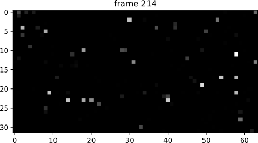

# Hermes Python Bindings


## Requirements
- Pre-installed Hermes drivers, please refer to the Hermes SDK documentation
- Python 3.x
- Python modules: matplotlib (pip install matplotlib)
- (optional) opencv-python package (pip install opencv-python)

## Supported architectures and platforms
Currently only the x86_64 (i.e. AMD64) architecture on both Linux and Windows is supported.
For additional architectures and/or platforms please contact Micro Photon Devices.

## Introduction
This directory contains the Python bindings for the Hermes camera SDK and some test/example scripts.
- <em>Hermes.py</em> defines the Hermes wrapping all hermes SDK functions
- <em>HermesExamples.py</em> is a collection of self-contained example scripts
- the <em>lib</em> directory contains the Hermes SDK libraries (.dll for Windows, .so for linux)

## Getting Started
Connect and power up the Hermes Camera.
A quick test of the camera in <em>Live</em> can be performed by running <em>HermesExamples.py</em> in the command line or in the Python IDE of choice.

On Windows Powershell:
```console
python HermesExamples.py
```
On Linux Terminal:
```console
python3 HermesExamples.py
```
This should display a series of acquired live frames like below:



## Additional Examples
In a new .py script in this directory import all example functions contained in <em> HermesExamples.py</em> and run them at will.
The other examples implement almost all Hermes functionalities.
```python
from HermesExamples import *

# run the Live mode example
ExampleLive()
# run the subarray mode test
ExampleLiveSubArray()
# run the background subtraction example
ExampleBackgroundSubtraction()
# run the snap acquisition mode example
ExampleSnap()
# run the continuous acquisition on file example
ExampleContinuousFile()
# run the continuous acquisition in memory example
ExampleContinuousInMemory()
# run the FLim mode example
ExampleFlim()
# run the Opencv example 
ExampleOpenCv()

```
The content of all example functions in <em> HermesExamples.py</em> can be used as a starting point for other user scripts.